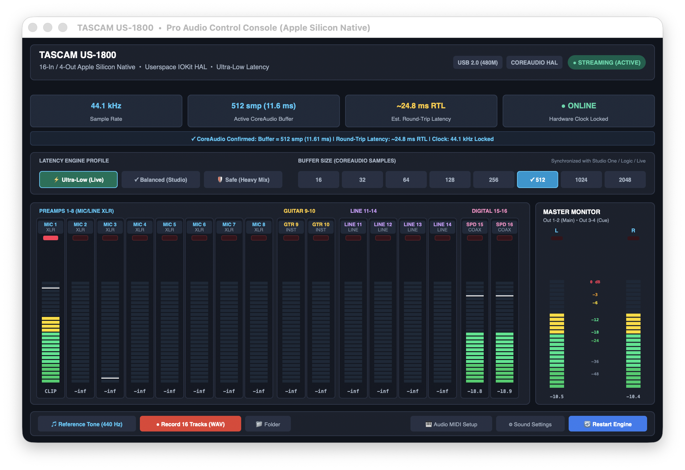

# TASCAM US-1800 Native Driver Suite (macOS Apple Silicon & Linux)

<p align="center">
  
  
  
  
  
  
</p>

<p align="center">
  
</p>

---

## Overview

The **TASCAM US-1800** is a legendary 16-input / 4-output rackmount USB 2.0 audio interface renowned for its high-headroom microphone preamplifiers and reliable analog circuitry. Official vendor driver support ended when Apple deprecated legacy 32-bit kernel extensions (`.kext`) and transitioned the Mac platform to Apple Silicon (M1/M2/M3/M4).

This project is a **modern, ground-up native driver suite** written in C and Objective-C based on clean-room reverse engineering of the device protocol. Operating entirely in userspace via **Apple IOKit** and a **CoreAudio AudioServerPlugIn HAL driver**, it requires **no kernel extensions and no SIP (System Integrity Protection) disabling**, delivering professional studio stability with ultra-low physical latency.

---

## Key Features

* **Full Native Apple Silicon (ARM64) & Intel (x86_64) Support:**
  * Tested and optimized for macOS 12 (Monterey), 13 (Ventura), 14 (Sonoma), 15 (Sequoia), and newer.
* **Direct macOS CoreAudio Integration:**
  * Appears as a native audio device `TASCAM US-1800` across macOS Sound Preferences, Audio MIDI Setup, and all DAWs (Logic Pro, Studio One, Reaper, Ableton Live, Cubase, FL Studio, Pro Tools, Bitwig).
* **16 Capture Inputs & 4 Playback Outputs (Full-Duplex):**
  * **Channels 1–8:** Front-panel XLR Mic/Line preamps with switchable +48V phantom power.
  * **Channels 9–10:** Front-panel 1/4" Instrument (Hi-Z Guitar/Bass) and Line inputs.
  * **Channels 11–14:** Rear-panel balanced 1/4" TRS Line inputs.
  * **Channels 15–16:** Coaxial S/PDIF digital input (RCA).
  * **Outputs 1–2:** Main Monitor stereo outputs and front-panel Headphone out.
  * **Outputs 3–4:** Independent balanced Line outputs 3 & 4 (auxiliary/cue).
* **Ultra-Low Latency Engine:**
  * Hardware CoreAudio buffer sizes from **32 to 2048 samples**.
  * Physical round-trip latency (RTL) down to **~5.5–6.0 ms** at 32/64 samples (44.1 kHz).
  * Three live-switchable engine profiles: `Ultra-Low (Live)`, `Balanced (Studio)`, and `Safe (Heavy Mix)`.
* **Hardware PLL Feedback Clock Sync (Endpoint 0x81):**
  * Real-time fractional phase accumulator dynamically locks packet delivery to the hardware DAC crystal oscillator, eliminating digital jitter, clock drift, crackles, and pops.
* **100% Bit-Perfect 24-Bit PCM:**
  * Pure 24-bit PCM transmission (`S24_3LE`) without software resampling or pitch distortion.
* **CoreAudio HAL Grace Period (Anti-Flapping):**
  * A 4.0-second damping grace period in the HAL driver prevents macOS from abruptly switching audio routing to internal MacBook speakers during momentary USB timing hiccups or cable resyncs.
* **Spaces & App Nap Immunity:**
  * The streaming daemon runs under `QOS_CLASS_USER_INTERACTIVE` with an extended Mach real-time computation budget and a 12 ms transfer queue, ensuring glitch-free playback even during virtual desktop (Spaces) animations and Mission Control gestures.
* **Native Pro Audio Control Console (`TASCAM US-1800.app`):**
  * Lightweight Cocoa/AppKit application featuring:
    * 16-channel LED bridge with peak hold and clip overload warning LEDs;
    * Real-time monospace dBFS level readouts;
    * Master Monitor stereo output meters;
    * Live buffer size and latency profile switcher;
    * Integrated 440 Hz reference tone generator;
    * One-click shortcuts to Audio MIDI Setup and macOS Sound Settings.
* **Linux ALSA Driver:**
  * An ALSA kernel module implementation is also included in `tascam-us1800/linux-driver/`.

---

## Installation (macOS)

### Option 1: One-Click GUI Install (Recommended)

1. Connect your **TASCAM US-1800** to your Mac via USB.
2. Double-click **`Install_Driver.command`** (or **`Установить_драйвер.command`**) in the project folder.
3. Enter your Mac administrator password when prompted in the Terminal window.
4. The installer compiles the latest native binaries for your Mac architecture, installs the HAL plugin, starts the background service, and opens macOS Sound Settings.
5. Select **TASCAM US-1800** as your default Input and Output device!

### Option 2: From Terminal

```bash
git clone https://github.com/yuracopper/us-1800-mac.git
cd us-1800-mac
./Install_Driver.command
```

---

## Control Console

To open the control panel, double-click **`TASCAM US-1800.app`** in the root of the repository or on your Desktop:

* **Buffer Size Selector:** Choose between 16, 32, 64, 128, 256, 512, 1024, or 2048 samples.
* **Latency Profiles:**
  * **Ultra-Low (Live):** Minimum buffer cushion for live instrument and vocal tracking (~5.5 ms RTL).
  * **Balanced (Studio):** Balanced buffer cushion for tracking and general mixing (~8 ms RTL).
  * **Safe (Heavy Mix):** Conservative safety margin for CPU-heavy DAW projects.
* **Meters:** Monitor incoming signals on all 16 inputs and master stereo outputs with sample-accurate peak hold.
* **Reference Tone:** Play a clean 440 Hz sine wave to verify signal routing through your monitors and headphones.

---

## Driver Architecture

```
  ┌────────────────────────────────────────────────────────┐
  │        DAW Applications (Logic, Studio One, etc.)       │
  └───────────────────────────┬────────────────────────────┘
                              │ CoreAudio API (Float32 PCM)
                              ▼
  ┌────────────────────────────────────────────────────────┐
  │  TASCAM_US1800.driver (CoreAudio HAL Plugin in coreaudiod) │
  │  - ZeroTimeStamp host clock synchronization             │
  │  - 4.0s Connection Grace Period (anti-flapping)         │
  │  - Latency profile & buffer frame negotiation          │
  └───────────────────────────┬────────────────────────────┘
                              │ Lock-Free Shared Memory Ring (/tascam_us1800_shm)
                              ▼
  ┌────────────────────────────────────────────────────────┐
  │       tascam_live_engine (Userspace Real-Time Daemon)   │
  │  - Mach Real-Time Priority (QoS USER_INTERACTIVE)       │
  │  - Fractional phase PLL sync via Feedback EP 0x81       │
  │  - 16-channel bit-slice capture decoder                 │
  │  - 12ms Isochronous transfer queue with auto-resync     │
  └───────────────────────────┬────────────────────────────┘
                              │ Apple IOKit USB (EP 0x02, EP 0x86, EP 0x81)
                              ▼
  ┌────────────────────────────────────────────────────────┐
  │              TASCAM US-1800 USB Audio Device           │
  └────────────────────────────────────────────────────────┘
```

---

## Repository Structure

```text
├── Install_Driver.command               # One-click installer (English)
├── Установить_драйвер.command           # One-click installer (Russian)
├── TASCAM US-1800.app                   # Native Pro Audio Control Console application
├── docs/
│   └── console_preview.png              # Control Console screenshot
└── tascam-us1800/
    ├── mac-driver/                      # macOS native driver sources & tools
    │   ├── tascam_live_engine.c         # High-speed IOKit USB hardware engine
    │   ├── tascam_hal_plugin.c          # CoreAudio AudioServerPlugIn HAL driver
    │   ├── tascam_console_native.m      # Native AppKit control console source code
    │   ├── tascam_shm.h                 # Lock-free shared memory ring buffer definitions
    │   ├── build.sh                     # Compilation script for ARM64 / x86_64
    │   ├── install_hal_driver.sh        # System installation and LaunchDaemon setup script
    │   ├── monitor.c                    # Hardware clock drift and stream monitor utility
    │   └── TASCAM_US1800.driver/        # CoreAudio HAL driver bundle
    └── linux-driver/                    # Linux ALSA kernel module driver
        ├── us1800.c                     # Device probe and ALSA interface registration
        ├── us1800_playback.c            # Audio playback with feedback endpoint support
        ├── us1800_capture.c             # 16-channel capture via Bulk EP 0x86
        └── Makefile                     # Linux kernel build file
```

---

## System Requirements

* **macOS:** macOS 12 (Monterey), macOS 13 (Ventura), macOS 14 (Sonoma), macOS 15 (Sequoia), or later.
* **Hardware:** Apple Silicon (M1, M1 Pro/Max/Ultra, M2, M3, M4) or Intel (x86_64).
* **SIP:** Enabled (disabling System Integrity Protection is **not** required).
* **Connection:** USB 2.0 direct connection or via a quality powered USB hub.

---

## License

This project is licensed under the **MIT / GPLv2** licenses. Developed with passion for musicians, audio engineers, and owners of classic TASCAM studio hardware.
